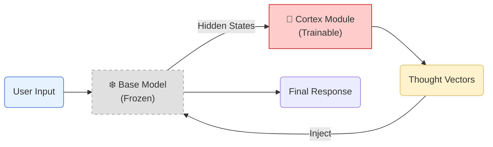
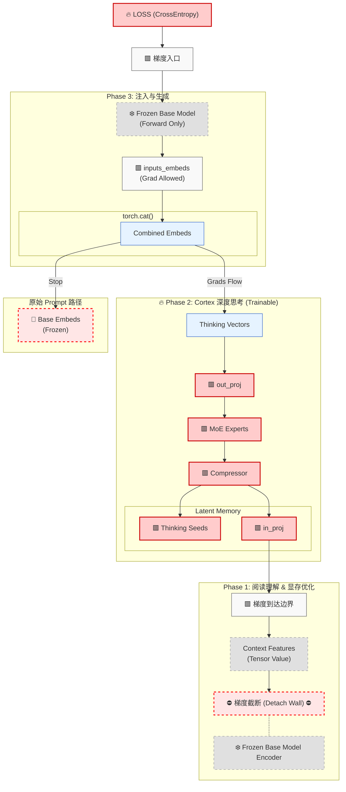

# 🧠 Cortex LLM: Plug-and-Play System 2 Reasoning Module

[**Cortex LLM**](https://alanhome.github.io/cortex-llm/Cortex_LLM.pdf) 是一个轻量级、可插拔的 **"System 2" 推理增强模块**。它不需要微调（Fine-tune）庞大的基座模型（Base Model），而是通过挂载一个可学习的“大脑皮层”（Cortex），在冻结的 LLM 之上通过生成“思维向量（Thought Vectors）”，从而引导模型进行更深层次的推理。

核心理念：**冻结直觉（System 1），训练思考（System 2）。**

---

## ✨ 核心特性 (Key Features)

* **🧩 非侵入式架构 (Non-Invasive)**: 基座模型（如 Qwen, Llama）参数完全冻结，仅训练 Cortex 模块。
* **⚡ 极低显存占用 (VRAM Efficient)**: 采用 **Gradient Detachment** 技术，阻断反向传播进入基座模型的 Encoder 部分，显存占用仅为全量微调的 1/10。
* **🚀 GB200/GB10 硬件优化**: 针对 NVIDIA Grace Blackwell 架构的 Unified Memory 进行了 Zero-Copy 优化，利用 CPU/GPU 统一内存进行实时思维可视化。
* **🛡️ 鲁棒的训练流程**: 内置 OOM 预检（Warmup）、动态梯度流修正和详细的 WandB 监控。

---

## 🏗️ 架构概览 (Architecture)

Cortex 的工作流程分为三个阶段：**阅读 (Read)** -> **思考 (Think)** -> **表达 (Speak)**。



### 🧠 梯度流向图 (Gradient Flow)

这是本项目的核心训练逻辑。注意 **红色** 路径代表参数更新，**灰色虚线** 代表梯度截断（为了节省显存）。



---

## 📂 项目结构 (Structure)

```text
cortex-llm/
├── README.md                   # 项目说明文档
├── run.sh                      # 通用任务启动入口
├── run_local.sh                # 本地环境启动脚本
├── run_docker.sh               # Docker 环境启动脚本
└── src/                        # 核心源代码
    ├── config.py               # 全局超参数配置 (Model & Training Config)
    ├── model_deep.py           # 模型核心定义 (CortexDeepModel, AdvancedMoERouter)
    ├── train_deep.py           # 深度思考训练主循环 (含 GB10 显存优化 & Debug)
    ├── dataset.py              # 流式数据加载器 (StreamingDataset)
    ├── chat.py                 # 交互式对话与推理脚本 (System 2 Inference)
    ├── preprocess_v2.py        # 数据预处理主脚本 (Tokenization & Formatting)
    ├── preprocess_more_data.py # 增量数据预处理
    ├── analyze_data.py         # 数据集分布与统计分析
    ├── analyze_data_meta_info.py # 数据元信息分析
    ├── check_env.py            # 运行环境与硬件检查
    └── check_pt_data*.py       # 预训练数据完整性校验脚本 (Utility)
```

## 🛠️ 安装与使用 (Usage)

### 1. 环境准备

推荐使用 Python 3.10+ 和 PyTorch 2.1+ (支持 Flash Attention 2)。

```bash
pip install torch transformers wandb bitsandbytes tqdm

```

### 2. 配置 (Config)

修改 `config.py` 以适应你的硬件。

* 对于 **NVIDIA GB200/GB10**：可以开启更大的 `batch_size` 和 `num_heavy_experts`。
* 对于 **消费级显卡 (3090/4090)**：建议开启 `load_in_4bit` (需修改代码) 或减小 `encoder_layers`。

### 3. 启动训练

```bash
python train_deep.py

```

训练脚本会自动执行以下步骤：

1. **Memory Warmup**: 试运行一次最大长度数据，确保不会 OOM。
2. **Dataset Streaming**: 加载流式数据。
3. **Training Loop**: 使用 MoE 路由进行训练，并定期打印 Debug 快照。

---

## 🔍 技术细节 (Technical Details)

### Advanced MLP Router

位于 `model_deep.py`。

* 路由器使用 MLP (Input -> Hidden -> Tanh -> Output) 进行降维特征提取。
* **训练噪声 (Training Noise)**: 注入高斯噪声以鼓励探索。
* **负载均衡 (Load Balancing)**: 计算 `aux_loss` 防止路由坍缩（Collapse），避免所有 Token 都涌向同一个专家。

### GB10 Unified Memory Optimization

位于 `train_deep.py` -> `visualize_dynamic_thoughts`。

* 针对 Grace Blackwell 架构的 LPDDR5x 统一内存设计。
* **Zero-Copy**: 直接访问 `model.base_model.embed_tokens.weight.data`，无需将巨大的词表搬运到 CPU。
* **Tensor Core Compute**: 在 GPU 上计算余弦相似度，仅回传 Top-K 索引。

---

## 📝 引用与致谢

本项目受到了 "System 2" 理论（Kahneman）以及近期 Chain-of-Thought (CoT) 研究的启发。

如果你觉得这个项目对你有帮助，请给个 ⭐️ Star！

@article{niu2026cortex,
  title={Cortex-LLM: Plug-and-Play Continuous Latent Reasoning for Large Language Models},
  author={Alan},
  journal={arXiv preprint arXiv:2603.xxxxx},
  year={2026}
}
